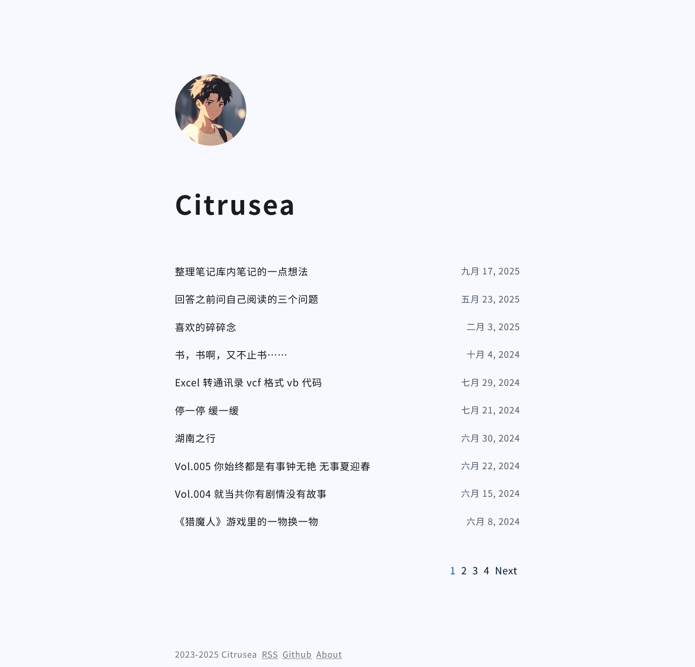

# Hey

---

<center></center>

支持版本
--------
```
Hexo:7.2.0^
```

有什么
--------

1. 极简风格
2. material design3 色彩
3. 支持分类、归档页面


Install
-------

```
$ git clone https://github.com/Jamyein/july-q.git themes/july-q
```

```
$ git subtitle add https://github.com/Jamyein/july-q.git themes/july-q
```


Enable
------

Modify theme setting in _config.yml to july-q

```
...
theme: july-q
...
```


Create Page
-----------

```
$ hexo new page about
```

Update
------

```
cd themes/hey
git pull
```

Configuration
-------------

```
# html lang
language: zh-CN

# main menu navigation
menu:
  主页: /index.html
  归档: /archives/index.html
  关于: /about/index.html

site:
  avatar: /img/avator.jpg # head portrait.

social:
  enable: true # true to enable the social media link, show you link to it.
  rss: /atom.xml
  github: https://github.com/Jamyein
  email: https://citrusea.cc/email/index.html

# stylesheets loaded in the <head>
stylesheets:
  - /css/markdown.css
  - /css/july.css
  - /css/waline.css # if use waline, please delete the "#" to use the waline.css

# scripts loaded in the end of the body
scripts:
  - /js/jquery-3.7.0.min.js

# atom: atom.xml # website feed. Suggested plugin for hexo about feeds.

favicon: /img/favicon.ico # you can change to you ico

waline: 
  enable: true # true to enable the waline
  serverURL: # your comment server url

since:2023 #You can modify here to change the copyright information at the bottom of the page.
```

Licence
-------

MIT
