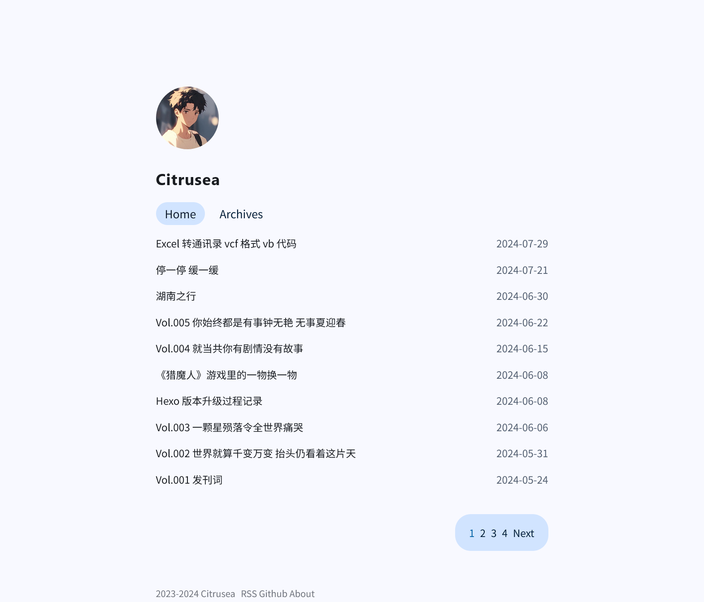

# Whales

---

<center></center>


Install
-------

```
$ git clone https://github.com/Jamyein/whales.git themes/whales
```

```
$ git subtitle add https://github.com/Jamyein/whales.git themes/whales
```


Enable
------

Modify theme setting in _config.yml to whales

```
...
theme: whales
...
```


Create Page
-----------

```
$ hexo new page about
```

Update
------

```
cd themes/whales
git pull
```

Configuration
-------------

```
# html lang
language: zh-CN

# main menu navigation
menu:
  Home: /index.html
  Archives: /archives/index.html
  About: /about/index.html

site:
  avatar: /img/avator.jpg # head portrait.

social:
  enable: true # true to enable the social media link, show you link to it.
  rss: /atom.xml
  github: https://github.com/Jamyein
  email: https://citrusea.cc/email/index.html

# atom: atom.xml # website feed.

favicon: /img/favicon.ico # you can change to you ico

waline: 
  enable: false # true to enable the waline
  serverURL: https://waline-1-z7968183.deta.app/ # your comment server url

since: 2023
```

Licence
-------

MIT
